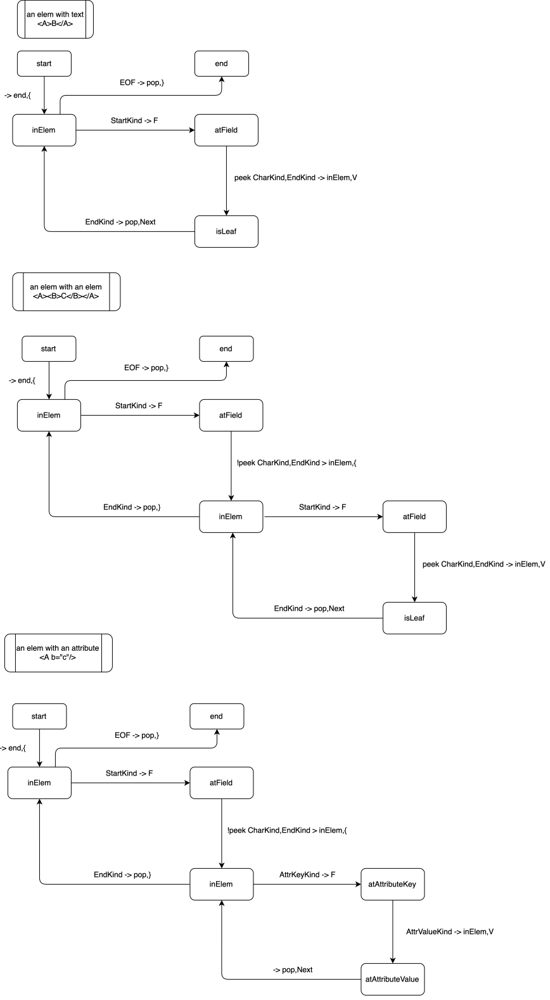

# Notes on implementation of the parser

The pull-based parser's Next and Skip methods are implemented using a stack based parser.
We explain the Next method using some state diagrams.

## Preliminaries

> Diagrams were drawn using [drawio](https://app.diagrams.net/).

The transitions are encoded as:

```
input -> pop/push/noop, emit 
```

Example 1 - an open element StartKind was decoded, so we emit a Field hint and leave the stack untouched:
```
StartKind -> F
```

Example 2 - an close element EndKind is decoded, so we emit a Leave hint and pop the stack:
```
EndKind -> pop,}
```

Example 3 - we peeked ahead two and they were not a CharKind followed by an EndKind, so we push inElem on the stack and emit a Leave hint:
```
!peek CharKind,EndKind > inElem,{
```

## Next Scenarios

Instead of drawing one state diagram, we show the state diagrams for the Next method in several scenarios:

* an elem with text `<A>B</A>`
* an elem with an elem `<A><B>C</B></A>`
* an elem with an attribute `<A b="c"/>`

